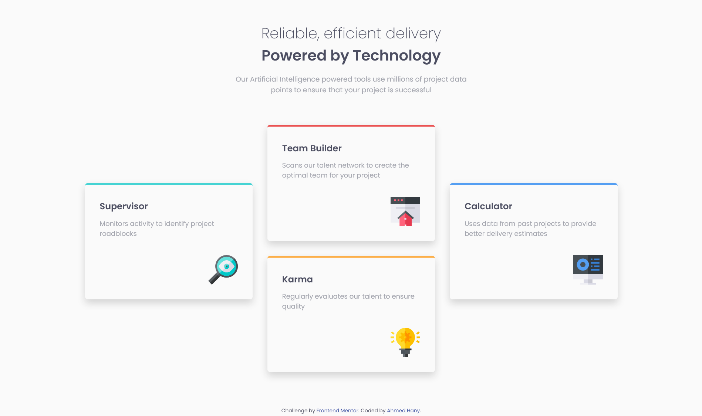

# Frontend Mentor - Four card feature section

## Table of contents

- [Overview](#overview)
  - [Screenshot](#screenshot)
  - [Links](#links)
- [My process](#my-process)
  - [Built with](#built-with)
  - [Useful resources](#useful-resources)
- [Author](#author)
- [Acknowledgments](#acknowledgments)

## Overview

### Screenshot

### Links

- [Solution](https://github.com/ahmedhanyh/four-card-feature-section)
- [Live Site](https://ahmedhanyh.github.io/four-card-feature-section/)

## My process

### Built with

- Semantic HTML5 markup
- CSS custom properties
- Flexbox
- CSS Grid
- BEM

## Author

- GitHub - [@ahmedhanyh](https://github.com/ahmedhanyh)
- Frontend Mentor - [@ahmedhanyh](https://www.frontendmentor.io/profile/ahmedhanyh)

## Acknowledgments

[@vcarames](https://www.frontendmentor.io/profile/vcarames) helped me structure the HTML content correctly.
